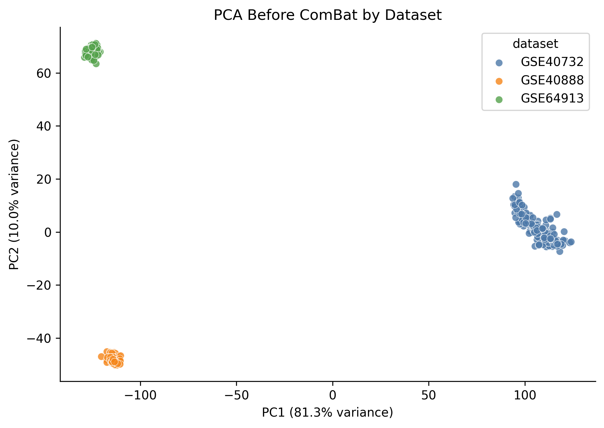
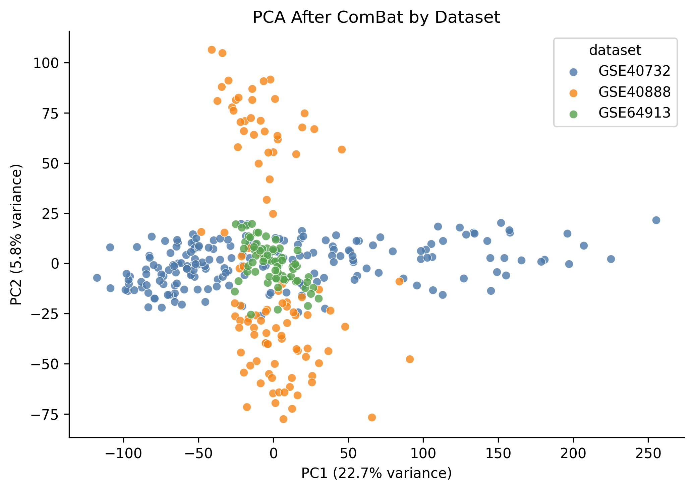
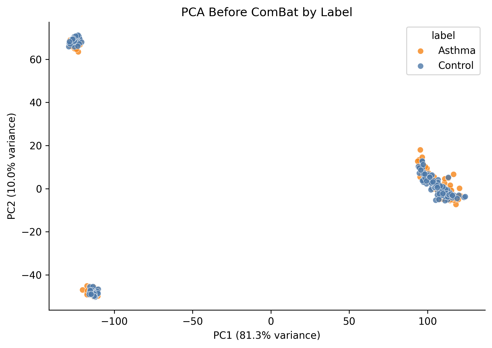
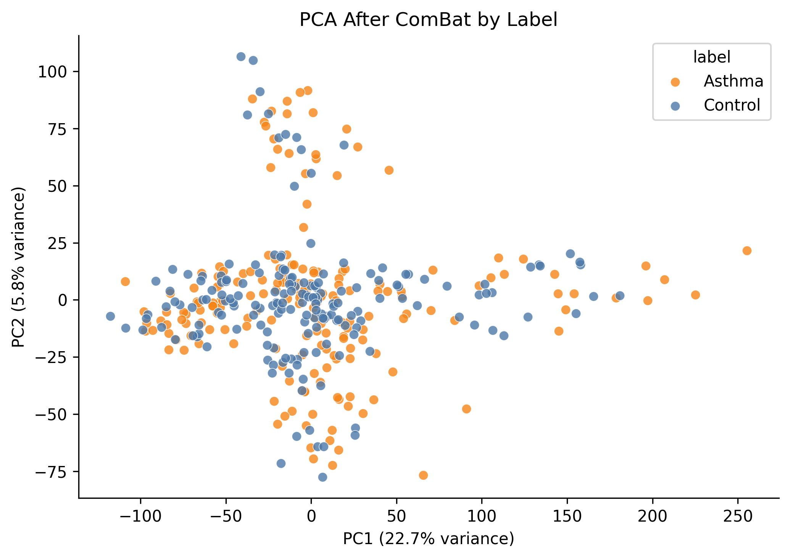
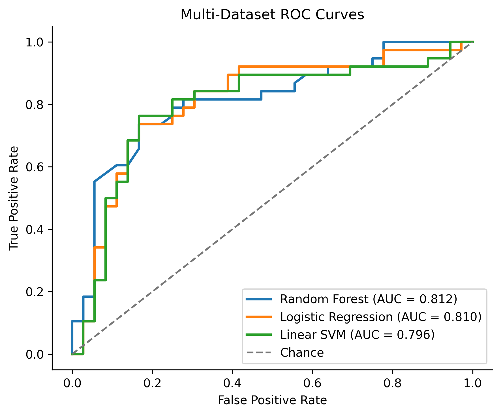

# Asthma Gene Expression Prediction

## Project Overview

This repository presents a portfolio-focused biomedical machine learning pipeline for asthma vs control classification using public GEO gene expression datasets.

The project was reconstructed and expanded from a previous university biomedical data science project, with the current version focusing on reproducible preprocessing, multi-dataset integration, batch correction, PCA inspection, baseline modeling, and evaluation.

The completed portfolio workflow includes both a single-dataset MVP using `GSE40732` and a multi-dataset pipeline using `GSE40732`, `GSE40888`, and `GSE64913`. The focus is reproducible data preprocessing, gene-symbol alignment, multi-dataset integration, ComBat batch correction, PCA inspection, baseline modeling, evaluation, and limitations.

This project is for research and education purposes only. It is not a clinically validated asthma prediction tool and should not be used for diagnosis, clinical decision support, or biomarker claims.

## Motivation

Childhood asthma is biologically complex, and public gene expression datasets provide a realistic setting for practicing biomedical data preprocessing and machine learning under real constraints: heterogeneous cohorts, different platforms, different sample types, high-dimensional expression features, and limited sample sizes.

The portfolio version emphasizes reproducibility, transparent assumptions, and honest limitations rather than clinical usefulness.

## Datasets

The multi-dataset version integrates three public GEO datasets:

| Dataset | Samples |
| --- | ---: |
| `GSE40732` | 194 |
| `GSE40888` | 105 |
| `GSE64913` | 70 |
| **Total** | **369** |

Final merged label counts:

- 190 Asthma samples
- 179 Control samples

After probe-to-gene mapping and duplicate gene-symbol collapsing, the final merged matrix contains:

- 369 samples
- 15,622 common genes shared across all three datasets

The original group project also included a Shiny demonstration interface, but this portfolio reconstruction focuses on the reproducible data preprocessing and machine learning pipeline.

## Completed Workflow

1. Extracted local GEO series matrix files for `GSE40732`, `GSE40888`, and `GSE64913`.
2. Built a single-dataset MVP using `GSE40732`.
3. Built a multi-dataset pipeline using `GSE40732`, `GSE40888`, and `GSE64913`.
4. Mapped probe-level features to standard gene symbols.
5. Collapsed duplicate gene symbols by averaging expression values.
6. Aligned common genes across datasets.
7. Created a merged expression matrix with 369 samples and 15,622 common genes.
8. Applied ComBat batch effect correction using `model.matrix(~ label)` to preserve asthma/control label structure.
9. Visualized PCA before and after ComBat correction.
10. Trained baseline models on the ComBat-corrected multi-dataset matrix.

## Methods

The project uses:

- R/Bioconductor: `GEOquery`, `Biobase`, `AnnotationDbi`, `org.Hs.eg.db`, `sva`
- Python: `pandas`, `numpy`, `matplotlib`, `scikit-learn`
- Gene-symbol mapping from platform annotations and RefSeq accessions
- Duplicate gene-symbol collapsing by mean expression
- Common-gene intersection across datasets
- ComBat batch correction with biological label preservation
- PCA before and after batch correction
- Baseline classifiers with `StandardScaler` and `SelectKBest(f_classif)`

Baseline models:

- Logistic Regression
- Random Forest
- Linear SVM

Random Forest is configured with `n_jobs=1` to avoid Windows multiprocessing permission issues.

## PCA and Batch Correction

PCA showed strong dataset-level structure before ComBat correction:

- Before ComBat: PC1 variance 0.8129, PC2 variance 0.0997
- After ComBat: PC1 variance 0.2267, PC2 variance 0.0582

The sharp reduction in PC1 explained variance after ComBat suggests that the dominant dataset-level batch effect was substantially reduced. However, residual heterogeneity may remain because the datasets differ in cohort design, experimental platform, and biological sample type.









## Results

Baseline held-out test results on the ComBat-corrected multi-dataset matrix:

| Model | Accuracy | F1-score | ROC-AUC |
| --- | ---: | ---: | ---: |
| Random Forest | 0.757 | 0.769 | 0.812 |
| Logistic Regression | 0.757 | 0.775 | 0.810 |
| Linear SVM | 0.770 | 0.785 | 0.796 |

Random Forest achieved the highest ROC-AUC in the current multi-dataset baseline run, while Linear SVM achieved the highest accuracy and F1-score. These results should be interpreted as exploratory baseline performance only, not evidence of clinical usefulness.



## Key Outputs

Generated processed data files, such as the merged expression matrices and labels, are written to `data/processed/` when the pipeline is run locally. These files are not tracked in Git because they are generated data outputs.

Tracked result summaries include:

- `results/common_genes_summary.csv`
- `results/pca_combat_summary.csv`
- `results/multi_dataset_model_metrics.csv`
- `results/multi_dataset_selected_features.csv`

Results:

- `results/common_genes_summary.csv`
- `results/pca_combat_summary.csv`
- `results/multi_dataset_model_metrics.csv`
- `results/multi_dataset_selected_features.csv`

Single-dataset MVP outputs are also retained for `GSE40732`, including EDA figures, PCA coordinates, and baseline model metrics.

## Repository Structure

```text
asthma-gene-expression-prediction/
|-- data/
|   |-- raw/
|   `-- processed/
|-- notebooks/
|   |-- 01_data_loading_and_eda.ipynb
|   |-- 02_preprocessing_and_pca.ipynb
|   |-- 03_modeling_and_evaluation.ipynb
|   |-- 04_multi_dataset_gene_alignment.ipynb
|   |-- 05_batch_correction_and_pca.ipynb
|   `-- 06_multi_dataset_modeling.ipynb
|-- src/
|   |-- extract_gse40732.R
|   |-- extract_geo_series_matrix.R
|   |-- map_gse40732_refseq_to_symbols.R
|   |-- apply_combat_correction.R
|   |-- data_preprocessing.py
|   |-- feature_selection.py
|   |-- modeling.py
|   `-- evaluation.py
|-- figures/
|-- results/
|-- README.md
|-- requirements.txt
`-- .gitignore
```

## How to Run

1. Create and activate a Python environment.
2. Install Python dependencies:

   ```bash
   pip install -r requirements.txt
   ```

3. Install required R/Bioconductor packages if needed:

   ```r
   install.packages("BiocManager")
   BiocManager::install(c("GEOquery", "Biobase", "AnnotationDbi", "org.Hs.eg.db", "sva"))
   ```

4. Place raw GEO series matrix files in `data/raw/`:

   ```text
   data/raw/GSE40732_series_matrix.txt.gz
   data/raw/GSE40888_series_matrix.txt.gz
   data/raw/GSE64913_series_matrix.txt.gz
   ```

5. Extract GEO series matrix files:

   ```bash
   Rscript src/extract_geo_series_matrix.R
   ```

6. Map `GSE40732` RefSeq accessions to gene symbols:

   ```bash
   Rscript src/map_gse40732_refseq_to_symbols.R
   ```

7. Run the notebooks in order through multi-dataset alignment:

   ```text
   notebooks/01_data_loading_and_eda.ipynb
   notebooks/02_preprocessing_and_pca.ipynb
   notebooks/03_modeling_and_evaluation.ipynb
   notebooks/04_multi_dataset_gene_alignment.ipynb
   ```

8. Apply ComBat correction:

   ```bash
   Rscript src/apply_combat_correction.R
   ```

9. Run the final notebooks:

   ```text
   notebooks/05_batch_correction_and_pca.ipynb
   notebooks/06_multi_dataset_modeling.ipynb
   ```

## Limitations

This is a proof-of-concept portfolio project and should be interpreted cautiously.

- The data are high dimensional relative to the sample size: 15,622 common genes and 369 samples.
- The integrated cohorts are heterogeneous and come from different GEO studies.
- The datasets include different biological sample types and experimental contexts.
- Label harmonization is simplified to asthma vs control and may lose clinical nuance.
- ComBat reduces dataset-level effects but may not remove all residual batch effects.
- Baseline models may still overfit despite feature selection and held-out testing.
- There is no independent clinical validation cohort.
- The results are not clinically validated and should not be used for diagnosis or decision support.

## Planned Extensions

Future portfolio extensions may include:

- Leave-one-dataset-out validation
- More robust cross-validation and uncertainty reporting
- Sensitivity analysis for feature-selection choices
- Comparison of pre- and post-ComBat model behavior
- Optional two-stage asthma severity classification
- A concise portfolio report summarizing methodology, results, and limitations
